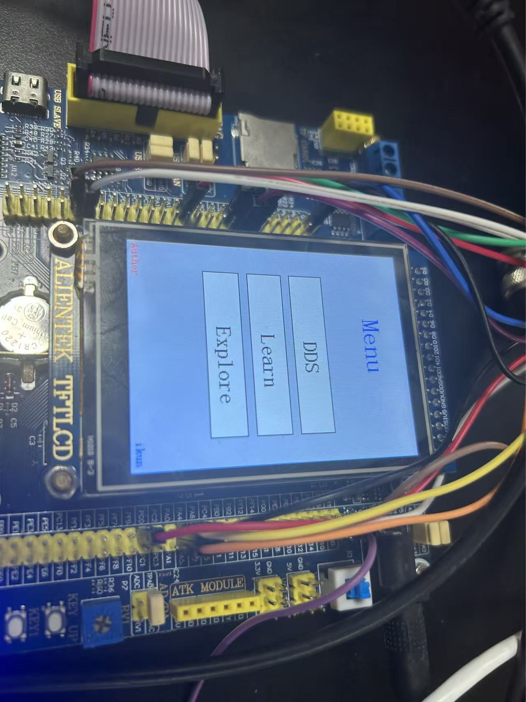

# stm32F1xx-ad9959

基于 **STM32F103ZET6** 平台，驱动 **AD9959 DDS 频率发生器** 的实验项目。  
本项目参赛 **TI 2025 G 题**，支持 **正点原子 TFTLCD 触摸屏** 作为控制界面。  

---

## ✨ 项目简介
本项目以 **正点原子精英 F103 开发板** 为核心，结合 **AD9959 DDS 模块**，实现波形频率的可视化控制与调试。
实验基于 **正点原子 TFTLCD 触摸例程**，用户可通过触摸屏与串口调试助手进行交互。

---

## 🛠️ 硬件平台
- **核心 MCU**: STM32F103ZET6  
- **DDS 芯片**: AD9959  
- **开发板**: 正点原子精英板F103  
- **显示与交互**: 2.8/3.5/4.3/7/10 寸 MCU TFTLCD 模块 (8080 16 位并口)  
- **触摸屏**: 电阻式 / 电容式  
- **串口调试**: CH340 转接，默认波特率 `115200`

---

## 🚀 快速开始
1. 使用 **STM32CubeIDE 或 Keil / MDK** 打开工程文件。  
2. 编译并下载到 **STM32F103ZET6** 开发板。  
3. 确认 **AD9959、LCD、触摸屏、串口** 等硬件连接正确。  
4. 打开串口调试助手（115200），即可测试 DDS 输出信号。  

---

## 📌 硬件资源及引脚分配

### 🔴 LED 灯
| 名称 | 引脚 | 宏定义 |
|------|------|------|
| DS0 (RED)   | PB5 | LED0 |
| DS1 (GREEN) | PE5 | LED1 |

### ⌨️ 独立按键
| 名称 | 引脚 | 宏定义 |
|------|------|--------|
| KEY0  | PE4 | KEY0 |
| KEY1  | PE3 | KEY1 |
| KEY_UP | PA0 | WK_UP |

### 🔌 串口
- 串口1 (PA9/PA10) → 板载 CH340 转 USB

### 🖥️ LCD 与触摸屏
- 支持 **正点原子 MCU TFTLCD 模块** (2.8/3.5/4.3/7/10 寸，16 位 8080 并口)  
- 支持 **电阻式 / 电容式** 触摸屏 

---

## ⚠️ 注意事项
1. 串口调试助手波特率必须设置为 **115200**。  
2. 推荐使用 **XCOM / SSCOM**，避免其他串口助手因 **DTR/RTS** 导致 MCU 复位。  
3. 串口输入字符串需以 **回车换行** 结束。  
4. 使用 USB 线连接 **USB_UART**，确保正确找到串口设备。  
5. PA9/PA10 必须通过跳线帽连接到 RXD/TXD。  
6. 使用 **4.3 寸 / 7 寸屏幕** 时，请提供足够电流：  
   - USB 供电可能不足  
   - 推荐外接 **12V 1A 电源适配器**  

---

## 📷 示意图
   

---

## 📂 项目结构
```bash
stm32F1xx-ad9959
├── Core/                # 核心代码
├── Drivers/BSP          # 底层驱动(含led\led\...)
├── Output/              # 编译调试文件
├── Middlewares/         # 芯片厂家代码库(st\ARM DSP库)
└── README.md            # 项目说明文档
